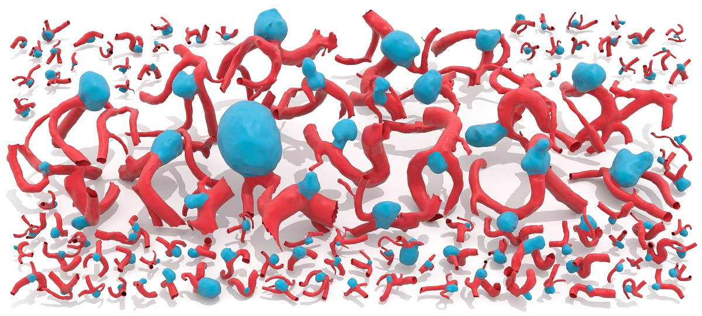
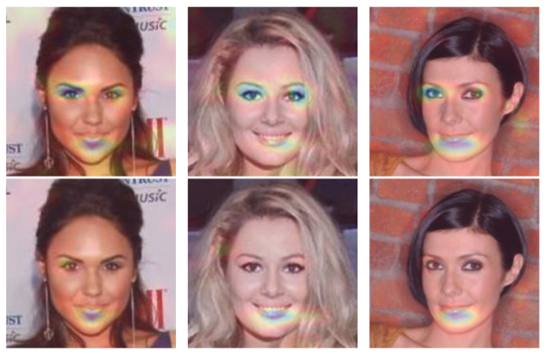
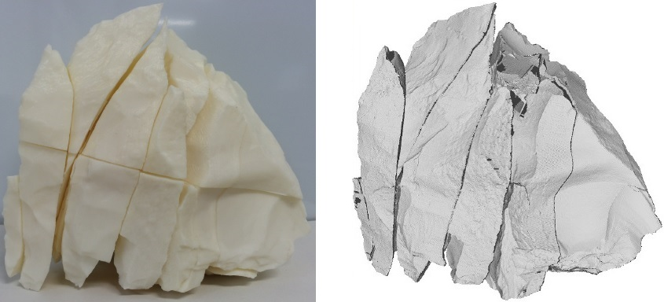
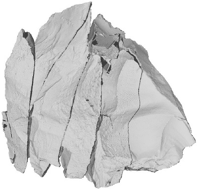
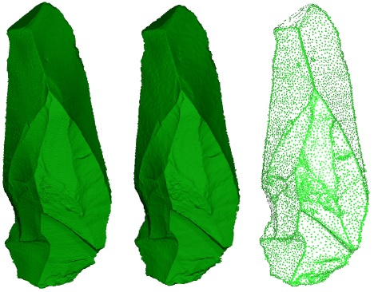

# Xi Yang (楊 溪)

## [CV](pic/cv.pdf  " ")

<big>Project Assistant Professor</big>  
[IGARASHI Laboratory](http://www-ui.is.s.u-tokyo.ac.jp/)  
The University of Tokyo   

Email: earthyangxi(AT)sina.com  

## Education

[KONNO Laboratory](http://gmhost.lk.cis.iwate-u.ac.jp/index.html)  
Ph.D in Faculty of Engineering from Iwate University, Japan in 2018  
ME degree in Faculty of Engineering from Iwate University, Japan in 2015  
[Zhiyi Zhang](http://cie.nwsuaf.edu.cn/szdw/js/2008118167/index.htm)  
BE degree in College of Information Engineering from Northwest A&F University, China in 2012  

## Research Interests

Computer graphics  
Human–computer interaction  
Deep learning  

## Projects

[3D Techniques for Medicine](https://github.com/intra3d2019/IntrA)

Xi Yang, Ding Xia, Taichi Kin, and Takeo Igarashi  
IntrA: 3D Intracranial Aneurysm Dataset for Deep Learning  
<pre class="tab">                   </pre> In Proceedings of the IEEE/CVF Conference on Computer Vision and Pattern Recognition (CVPR 2020) **Oral**   

[HCL for ML](https://htmlpreview.github.io/?https://github.com/KeepThinkingYX/Xi-Yang/blob/master/cvprw2019/pub.html)  
 
 
 
 
Xi Yang, Bojian Wu, Issei Sato, and Takeo Igarashi. "Directing DNNs Attention for Facial Attribution Classification using Gradient-weighted Class Activation Mapping." In CVPR Workshops, pp. 103-106. 2019.
 

[Visualization of Lithic Materials]()  
 
 
 
 
 
Xi Yang, Kouichi Konno, Fumito Chiba, Shin Yokoyama
  Visualization of Flake Knapping Sequence with Analyzing Assembled Chipped Stone Tools
  The Journal of Art and Science (2019)   
Xi Yang, Katsutsugu Matsuyama, Kouichi Konno
  Interactive Visualization of Assembly Instruction for Stone Tools Restoration
  The 10th IEEE Pacific Visualization Symposium (PacificVis 2017) 
 

[Matching Lithic Materials]()  
 
 
 
 
 
Xi Yang, Katsutsugu Matsuyama, Kouichi Konno
  Pairwise Matching of Stone Tools Based on Flake-Surface Contour Points and Normals
  Eurographics Workshop on Graphics and cultural Heritage (GCH 017)   
Xi Yang, Katsutsugu Matsuyama, Kouichi Konno
  A New Method of Refitting Mixture Lithic Materials by Geometric Matching of Flake Surfaces
  The Journal of Art and Science (2016)
 

[Point Cloud Simplification]()  
 
 
 
 
 
Xi Yang, Katsutsugu Matsuyama, Kouichi Konno, Yoshimasa Tokuyama
  A Feature Preserving Simplification of Point Cloud by Using Clustering Approach Based on Mean Curvature
  The Journal of Art and Science (2015)
 

<!--- ## Publications

### Journal

- **X.Yang**, K. Matsuyama, K. Konno: “A New Method of Refitting Mixture Lithic Materials by Geometric Matching of Flake Surfaces”, *The Journal of Art and Science*, Vol.15, No. 4, pp.167-176, 2016. **NICOGRAPH 2016 優秀論文賞**

- **X. Yang**, K. Matsuyama, K. Konno, Y. Tokuyama: “A Feature Preserving Simplification of Point Cloud by Using Clustering Approach Based on Mean Curvature”, *The Journal of Art and Science*, Vol.14, No.4, pp.117-128, 2015.

- Zhang Zhiyi\*, **Yang Xi**: “Interactively Controlled Generation Method for Class A Bezier Curve”, *Computer Applications and Software*, Vol.31, No.2, Feb. 2014.

### International Conference

- T. Lin, **X. Yang**, K. Konno: "A Method of Searching Lithic Cores by Average Linkage Clustering", *NICOGRAPH International 2018*, (2018).

- T. Batbold, **X. Yang**, K. Konno: "A Study of Finding Target Objects for Visualizing Stone Tool
Assembly", *NICOGRAPH International 2018*, (2018).

- T. Lin, **X. Yang**, K. Matsuyama, K. Konno: "An Edge Optimization Method Based on
Segmented Surfaces of Stone Flakes", *International Workshop on Advanced Image Technology
2018 (IWAIT 2018)*, (2018).

- **X. Yang**, K. Matsuyama, K. Konno: "Pairwise Matching of Stone Tools Based on Flake-Surface
Contour Points and Normals", *Eurographics Workshop on Graphics and cultural Heritage (GCH)*,
The Eurographics Association, (2017).

- **X. Yang**, K. Matsuyama, K. Konno: "Interactive Visualization of Assembly Instruction for Stone Tools Restoration", *The 10th IEEE Pacific Visualization Symposium (PacificVis 2017)*, pp.270-274, (2017).

### Domestic Conference

- **X. Yang**, K. Matsuyama, K. Konno, F. Chiba, S. Yokoyama: "Analysis and Visualization
Instruction by Flake Knapping Sequence for Chipped Stone Tools", *NICOGRAPH 2017*,
pp.1-8, (2017).

- **X. Yang**, K. Matsuyama, K. Konno, Y. Tokuyama: “A Feature Preserving Simplification of Point Cloud by Using Clustering Approach Based on Mean Curvature”, *NICOGRAPH 2014*, pp.9-16, 優秀論文賞，11 月 2-4 日，2014．

- **楊渓**，松山克胤，今野晃市：“曲率に基づくグループ化による計測点群の軽量化”, *平成 25 年度第４回 芸術科学会東北支部研究会*，3 月 29 日，2014．
-->
## Awards

- 平成28年度, **岩手大学学長賞**
- NICOGRAPH 2016, **優秀論文賞**
- 平成26年度, **岩手大学学長賞**
- NICOGRAPH 2014, **優秀論文賞**
- 豊嶋宏太，森本由宇，佐々木尭，*楊渓*：“Digital Planisphere”，アート＆テクノロジー東北２０１４，**審査員特別賞**，6月28日，2014.
- *FREESPACE team*: “ActivityAnalyse”，**一等奖**，西北农林科技大学第六届软件设计大赛，2011.

## Links

[Xi Yang - cnblogs](http://www.cnblogs.com/yangxi/)  

