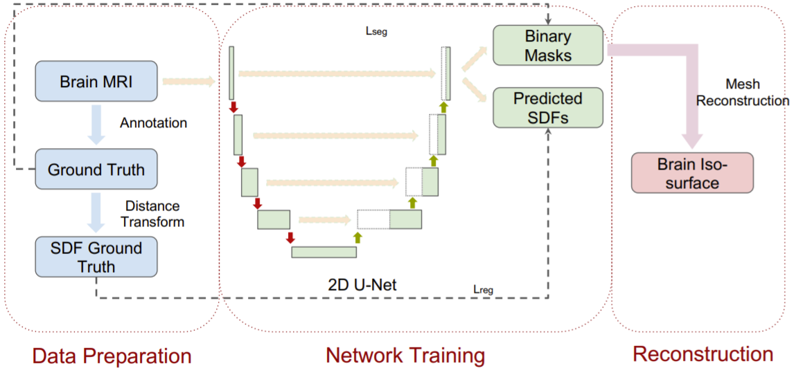
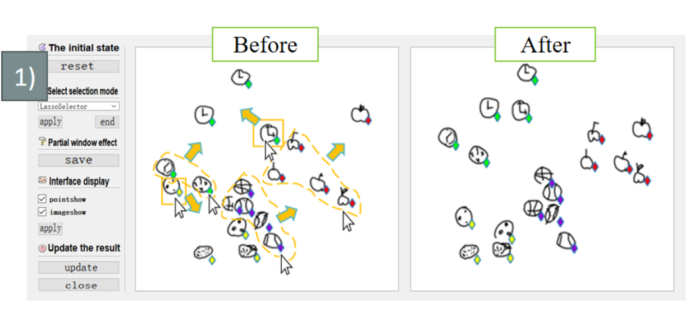
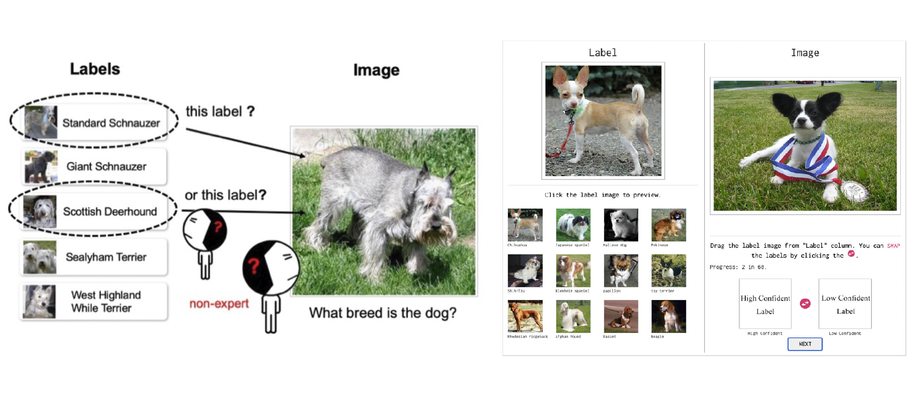
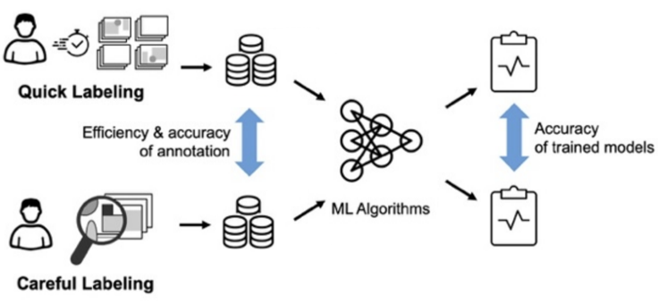
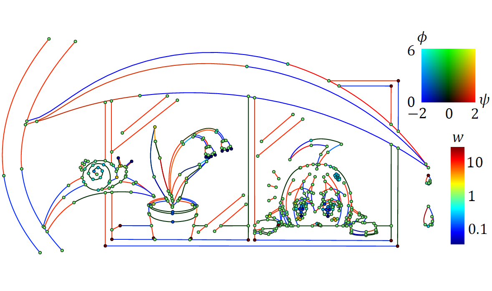
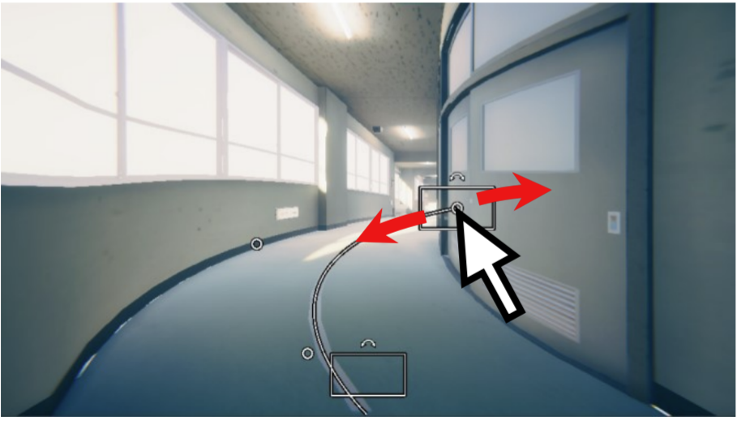
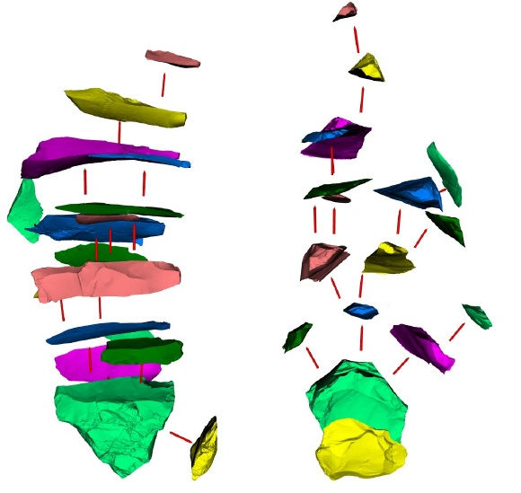

# Xi Yang (楊 溪)

## News

> 2022.09.08 Received project support from the Young Scientists Fund of the National Natural Science Foundation of China.

> 2022.06.22 Supported by the "Lixin Outstanding Young Teacher Training Program" of Jilin University.

> 2022.06.04 Our work "HiVideo: Hierarchical Browsing Interface for Educational Videos" will be presented at SIGGRAPH 2022 as a poster.

> 2022.06.03 Our work "Data-driven Multi-Modal Partial Medical Image Preregistration by Template Space Patch" will be presented at MICCAI 2022.

> 2022.04.18 Our work "DualLabel: Secondary Labels for Challenging Image Annotation" will be presented at Graphics Interface (GI) 2022.

> 2022.04.17 Our work "Fine-tuning Deep Neural Networks by Interactively Refine the 2D Latent Space of Ambiguous Images" will be presented at IJCAI 2022 as a demo paper.

> 2022.02.25 Our "[2nd International Symposium on Intelligence Design (ISID 2022)](http://www.jaist.ac.jp/event/design2022/)" will be held from March 14 (Mon.) to 15 (Tue.). Wellcome to register and submit by 2/28, FREE!

> 2022.02.24 Our work "PPW curves: a C2 interpolating spline with hyperbolic blending of rational Bezier curves" will be published in IEICE Transactions on Information and Systems.

> 2022.01.18 Our work "An Empirical Study on the Effect of Quick and Careful Labeling Styles in Image Annotation" will be presented at Graphics Interface (GI) 2022.

> 2022.01.15 Our work "A Two-step Surface-based 3D Deep Learning Pipeline for Segmentation of Intracranial Aneurysms" will be published in Computational Visual Media (CVMJ).

> 2021.11.25 Received project support from the "Interdisciplinary Integration and Innovation" project of Jilin University.

<!--- > 2021.10.04 Our paper "Learning English to Chinese Character: Calligraphic Art Production based on Transformer" is accepted by SIGGRAPH ASIA 2021 Posters. -->

<!--- > 2021.06.01 Our paper is accepted by SIGGRAPH 2021 Posters. -->

<!--- > 2021.01.09 Our paper is accepted by ISBI 2021. -->

<!--- > 2020.09.17 Our paper is accepted by ACM SIGGRAPH ASIA 2020 Technical Communications. -->

## [CV pdf](pic/cv.pdf  " ")

<big>Associate Professor</big>  
[Interdisciplinary Intelligent Graphics Group (IIGG)](https://yang-group.github.io/)  
[School of Artificial Intelligence](https://sai.jlu.edu.cn/), Jilin University.  

Email: earthyangxi(AT)gmail.com  

## Work Experience
Project Assistant Professor (2018.4 - 2021.3)  
[IGARASHI Laboratory](http://www-ui.is.s.u-tokyo.ac.jp/), The University of Tokyo. 

## Education

[KONNO Laboratory](http://gmhost.lk.cis.iwate-u.ac.jp/index.html)  
Ph.D. in Faculty of Engineering from Iwate University, Japan in 2018  
ME degree in Faculty of Engineering from Iwate University, Japan in 2015  
[Zhiyi Zhang](http://cie.nwsuaf.edu.cn/szdw/js/2008118167/index.htm)  
BE degree in College of Information Engineering from Northwest A&F University, China in 2012  

## Research Interests

Computer Graphics  
Deep Learning  
Human-Computer Interaction  

## Research Topics

3D Deep Learning for Medicine

  
  
    Ding Xia, <b>Xi Yang</b>, Oliver van Kaick, Taichi Kin, and Takeo Igarashi 
    <b><a href=" ">Data-driven Multi-Modal Partial Medical Image Preregistration by Template Space Patch Mapping</a></b> 
    MICCAI, 2022
  

 

  
  
    <b>Xi Yang</b>, Ding Xia, Taichi Kin, and Takeo Igarashi 
    <b><a href="https://arxiv.org/abs/2006.16161">A Two-step Surface-based 3D Deep Learning Pipeline for Segmentation of Intracranial Aneurysms</a></b> 
    <!-- arXiv preprint, 2021 -->
    Computational Visual Media, 2022
  

 

  
  
    Heng Fang, <b>Xi Yang</b>, Taichi Kin, Takeo Igarashi 
    <b><a href="https://arxiv.org/abs/2104.04291">Brain Surface Reconstruction from MRI Images Based on Segmentation Networks Applying Signed Distance Maps</a></b> 
    2021 IEEE International Symposium on Biomedical Imaging (ISBI) (ISBI 2021)
  

 

  
  
    <b>Xi Yang</b>, Ding Xia, Taichi Kin, and Takeo Igarashi 
    <b><a href="https://github.com/intra3d2019/IntrA">IntrA: 3D Intracranial Aneurysm Dataset for Deep Learning</a></b> 
    In Proceedings of the IEEE/CVF Conference on Computer Vision and Pattern Recognition (CVPR 2020) <b>Oral</b>
  

 
  
HCL for ML

  
  
    Jiafu Wei, Haoran Xie, Chia-Ming Chang, <b>Xi Yang</b> 
    <b><a href=" ">Fine-tuning Deep Neural Networks by Interactively Refining the 2D Latent Space of Ambiguous Images</a></b> 
    IJCAI 2022 Demos
   

 

  
  
    Chia-Ming Chang, Yi He, <b>Xi Yang</b>, Haoran Xie, and Takeo Igarashi 
    <b><a href="https://openreview.net/forum?id=rrBz2lFETzq">DualLabel: Secondary Labels for Challenging Image Annotation</a></b> 
    Graphics Interface (GI) 2022
   

 

  
  
    Chia-Ming Chang, <b>Xi Yang</b>, and Takeo Igarashi 
    <b><a href="https://openreview.net/pdf?id=SDyj8aZBPrs">An Empirical Study on the Effect of Quick and Careful Labeling Styles in Image Annotation</a></b> 
    Graphics Interface (GI) 2022
   

 

  
  
    <b>Xi Yang</b>, Bojian Wu, Issei Sato, and Takeo Igarashi 
    <b><a href="https://htmlpreview.github.io/?https://github.com/KeepThinkingYX/Xi-Yang/blob/master/cvprw2019/pub.html">Directing DNNs Attention for Facial Attribution Classification using Gradient-weighted Class Activation Mapping</a></b> 
    In CVPR Workshops (2019)
   

 
 

Computational Arts

  
  
    Seung-Tak Noh, Hiroki Harada, <b>Xi Yang</b>, Tsukasa Fukusato, and Takeo Igarashi 
    <b><a href="">PPW curves: a C2 interpolating spline with hyperbolic blending of rational Bezier curves</a></b> 
    IEICE Transactions on Information and Systems
  

 

  
  
    Yifan Jin, Yi Zhang, <b>Xi Yang</b> 
    <b><a href="https://dl.acm.org/doi/fullHtml/10.1145/3476124.3488642">Learning English to Chinese Character: Calligraphic Art Production based on Transformer</a></b> 
    SIGGRAPH Asia 2021 Posters
  

 

  
  
    Koki Endo, Seung-Tak Noh, Kazutaka Nakashima, <b>Xi Yang</b>, Takeo Igarashi 
    <b><a href="https://dl.acm.org/doi/10.1145/3450618.3469156">A Suggestive Interface for Designing Dance Formations</a></b> 
    ACM SIGGRAPH 2021 Posters
  

 

  
  
    Itsuki Orito, <b>Xi Yang</b>, Kazutaka Nakashima, Tsukasa Fukusato, Takeo Igarashi 
    <b><a href="https://dl.acm.org/doi/10.1145/3410700.3425431">Distorted Perspective for the Forward Camera Dolly</a></b> 
    ACM SIGGRAPH ASIA 2020 Technical Communications
  

 

  
  
    Yinan Wang, <b>Xi Yang</b>, Tsukasa Fukusato, Takeo Igarashi 
    <b><a href="https://dl.acm.org/doi/10.1145/3355056.3364575">Computational Design and Fabrication of 3D Wire Bending Art</a></b> 
    ACM SIGGRAPH ASIA 2019 Posters
  

 
 
 

Geometry Processing for Lithic Materials
<!--Visualization of Lithic Materials-->

  
  
    <b>Xi Yang</b>, Kouichi Konno, Fumito Chiba, Shin Yokoyama 
    <b><a href="https://www.art-science.org/journal/v18n1/v18n1pp40/artsci-v18n1pp40.pdf">Visualization of Flake Knapping Sequence with Analyzing Assembled Chipped Stone Tools</a></b> 
    The Journal of Art and Science (2019) 
    <b>Xi Yang</b>, Katsutsugu Matsuyama, Kouichi Konno 
    <b><a href="https://ieeexplore.ieee.org/document/8031604">Interactive Visualization of Assembly Instruction for Stone Tools Restoration</a></b> 
    The 10th IEEE Pacific Visualization Symposium (PacificVis 2017)
  

 
<!--Matching Lithic Materials-->

  
  
    <b>Xi Yang</b>, Katsutsugu Matsuyama, Kouichi Konno 
    <b><a href="https://diglib.eg.org/handle/10.2312/gch20171303">Pairwise Matching of Stone Tools Based on Flake-Surface Contour Points and Normals</a></b> 
    Eurographics Workshop on Graphics and cultural Heritage (GCH 2017)
   

 

  
  
    <b>Xi Yang</b>, Katsutsugu Matsuyama, Kouichi Konno 
    <b><a href="https://www.art-science.org/journal/v15n4/v15n4pp167/artsci-v15n4pp167.pdf">A New Method of Refitting Mixture Lithic Materials by Geometric Matching of Flake Surfaces</a></b> 
    The Journal of Art and Science (2016) <b>NICOGRAPH 2016 優秀論文賞</b>
   

 
<!--Point Cloud Simplification-->

  
  
    <b>Xi Yang</b>, Katsutsugu Matsuyama, Kouichi Konno, Yoshimasa Tokuyama 
    <b><a href="https://art-science.org/journal/v14n4/v14n4pp117/artsci-v14n4pp117.pdf">A Feature Preserving Simplification of Point Cloud by Using Clustering Approach Based on Mean Curvature</a></b> 
    The Journal of Art and Science (2015) <b>NICOGRAPH 2014 優秀論文賞</b>
  

 
 

## Selected Publications ([Google Scholar](https://scholar.google.com/citations?user=EefsD-EAAAAJ&hl=ja), [dblp](https://dblp.org/pid/13/1520-17.html))

### Preprint
- **X. Yang**, D. Xia, T. Kin, T. Igarashi, “Surface-based 3D Deep Learning Framework for Segmentation of Intracranial Aneurysms from TOF-MRA Images”, arXiv preprint, arXiv:2006.16161, 2020.

### Journal

- C. Zhang, X. Lu, K. Hotta, **X. Yang**, “G2MF-WA: Geometric Multi-Model Fitting with Weakly Annotated Data”, Computational Visual Media, 10 pages, 2020.

- **X.Yang**, K. Konno, F. Chiba, S. Yokoyama, “Visualization of Flake Knapping Sequence with Analyzing Assembled Chipped Stone Tools”, The Journal of Art and Science, Vol.18, No.1, pp.40-50, 2019.

- **X.Yang**, K. Matsuyama, K. Konno: “A New Method of Refitting Mixture Lithic Materials by Geometric Matching of Flake Surfaces”, *The Journal of Art and Science*, Vol.15, No. 4, pp.167-176, 2016. **NICOGRAPH 2016 優秀論文賞**

- **X. Yang**, K. Matsuyama, K. Konno, Y. Tokuyama: “A Feature Preserving Simplification of Point Cloud by Using Clustering Approach Based on Mean Curvature”, *The Journal of Art and Science*, Vol.14, No.4, pp.117-128, 2015.

- Zhang Zhiyi\*, **Yang Xi**: “Interactively Controlled Generation Method for Class A Bezier Curve”, *Computer Applications and Software*, Vol.31, No.2, Feb. 2014.

### International Conference

- Koki Endo, Seung-Tak Noh, Kazutaka Nakashima, **Xi Yang**, Takeo Igarashi, "A Suggestive Interface for Designing Dance Formations", In ACM SIGGRAPH 2021 Posters (pp. 1-2).

- Heng Fang, **Xi Yang**, Taichi Kin, Takeo Igarashi, "Brain Surface Reconstruction from MRI Images Based on Segmentation Networks Applying Signed Distance Maps", 2021 IEEE International Symposium on Biomedical Imaging (ISBI) (ISBI 2021), April 13-16, 2021.

- Yi He, Haoran Xie, Chao Zhang, **Xi Yang**, Kazunori Miyata, Sketch-based Normal Map Generation with Geometric Sampling, International Workshop on Advanced Image Technology 2021, 2021.01.

- I. Orito, **X. Yang**, K. Nakashima, T. Fukusato, T. Igarashi, “Distorted Perspective for the Forward Camera Dolly”, ACM SIGGRAPH ASIA 2020 Technical Communications, 2020.

- Chunzhi Gu, Zhengyu Huang, Sicheng Li, Haoran Xie, **Xi Yang**, Chao Zhang. Apparel Generation via Cluster-Indexed Global and Local Feature Representations. IEEE 9th Global Conference on Consumer Electronics (GCCE 2020), short paper, Kobe, 2020.10.

- **X. Yang**, D. Xia, T. Kin, T. Igarashi, “IntrA: 3D Intracranial Aneurysm Dataset for Deep Learning”, IEEE Conference on Computer Vision and Pattern Recognition (CVPR 2020), Seattle, June 16 - 18, 2020. **Oral**

- **X. Yang**, B. Wu, I. Sato, T. Igarashi, “Directing DNNs Attention for Facial Attribution Classification using Gradient-weighted Class Activation Mapping”, *CVPR-19 Workshop on Explainable AI*, Long Beach, CA, June 16th - 20th, 2019.

- Y. Wang, **Xi Yang**, T. Fukusato, T. Igarashi, “Computational Design and Fabrication of 3D Wire Bending Art”, *ACM SIGGRAPH ASIA 2019 Poster*, Brisbane, 11.17-20, 2019.

- T. Lin, **X. Yang**, K. Konno: "A Method of Searching Lithic Cores by Average Linkage Clustering", *NICOGRAPH International 2018*, 2018.

- T. Batbold, **X. Yang**, K. Konno: "A Study of Finding Target Objects for Visualizing Stone Tool Assembly", *NICOGRAPH International 2018*, 2018.

- T. Lin, **X. Yang**, K. Matsuyama, K. Konno: "An Edge Optimization Method Based on Segmented Surfaces of Stone Flakes", *International Workshop on Advanced Image Technology 2018 (IWAIT 2018)*, 2018.

- **X. Yang**, K. Matsuyama, K. Konno: "Pairwise Matching of Stone Tools Based on Flake-Surface Contour Points and Normals", *Eurographics Workshop on Graphics and cultural Heritage (GCH)*, The Eurographics Association, 2017.

- **X. Yang**, K. Matsuyama, K. Konno: "Interactive Visualization of Assembly Instruction for Stone Tools Restoration", *The 10th IEEE Pacific Visualization Symposium (PacificVis 2017)*, pp.270-274, 2017.

### Domestic Conference

- 折登 樹, **楊 溪**, 中島一崇, 福里 司, 五十嵐健夫: "奥行方向への移動に対する非写実的なパースのインタラクティブな設計手法", 第28回 Visual Computing (VC2020), 27, オンライン, 2020.12.2-4. **優秀研究発表賞**

- **X. Yang**, K. Matsuyama, K. Konno, F. Chiba, S. Yokoyama: "Analysis and Visualization Instruction by Flake Knapping Sequence for Chipped Stone Tools", *NICOGRAPH 2017*, pp.1-8, 2017.

- **X. Yang**, K. Matsuyama, K. Konno, Y. Tokuyama: “A Feature Preserving Simplification of Point Cloud by Using Clustering Approach Based on Mean Curvature”, *NICOGRAPH 2014*, pp.9-16, 11 月 2-4 日, 2014．**優秀論文賞**

- **楊渓**，松山克胤，今野晃市：“曲率に基づくグループ化による計測点群の軽量化”, *平成 25 年度第４回 芸術科学会東北支部研究会*，3 月 29 日，2014．

## Awards

- 平成28年度, **岩手大学学長賞**
- NICOGRAPH 2016, **優秀論文賞**
- 平成26年度, **岩手大学学長賞**
- NICOGRAPH 2014, **優秀論文賞**
- 豊嶋宏太，森本由宇，佐々木尭，*楊渓*：“Digital Planisphere”，アート＆テクノロジー東北２０１４，**審査員特別賞**，6月28日，2014.
- *FREESPACE team*: “ActivityAnalyse”，**一等奖**，西北农林科技大学第六届软件设计大赛，2011.

## Service

### Program Committee

- International Symposium on Intelligence Design [2021](http://www.jaist.ac.jp/event/design2021/) [2022](http://www.jaist.ac.jp/event/design2022/)

### Review

- IEEE Transactions on Medical Imaging
- Neurocomputing
- CYBERWORLDS 2021
- NeurIPS 2021 Datasets and Benchmarks 
- International Journal of Human-Computer Studies
- IEEE VIS 2019
- GeoInformatica

